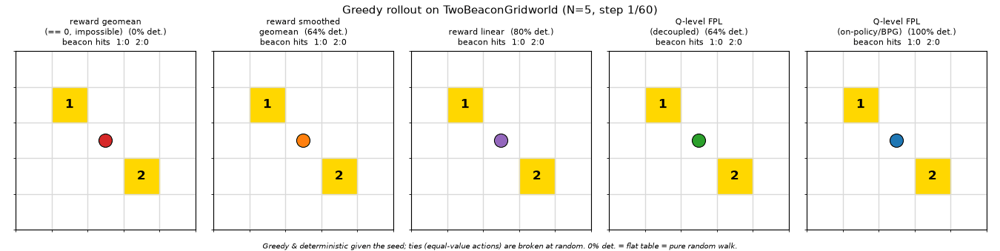
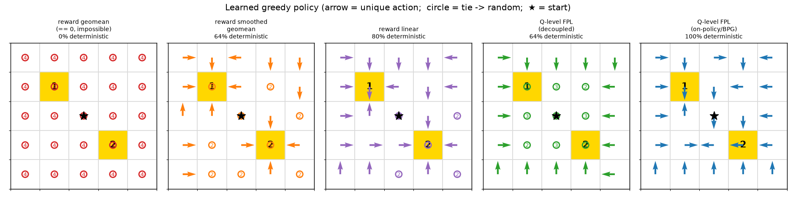

# TwoBeaconGridworld — composing sparse objectives at the Q-value level

This directory tests a single, focused claim from *Closing the intent-to-behavior
gap via Fulfillment Priority Logic* (FPL):

> When you compose multiple **sparse, binary** objectives with a non-linear
> conjunction (a geometric / power mean), composing at the **reward level** can
> collapse to *zero everywhere* — there is literally nothing to optimize —
> whereas composing the **Fulfillment-Q-values** turns each binary reward into a
> dense, continuous signal, so the same conjunction becomes learnable.

This is the "the binary version of FPL on the reward level will be continuous on
the Q level" idea, reduced to the smallest environment that makes it provable.

## The environment

`TwoBeaconGridworld-v0` is an `N × N` grid with two beacons that **never
overlap**:

```
. . . . . . . . .
. 1 . . . . . . .          1 = beacon_1 = (1, 1)
. . . . . . . . .          2 = beacon_2 = (N-2, N-2)
. . . . . . . . .          A = agent (starts at the center)
. . . . A . . . .
. . . . . . . . .          reward = [ r1, r2 ]
. . . . . . . . .          r1 = 1 iff on beacon_1, else 0
. . . . . . . 2 .          r2 = 1 iff on beacon_2, else 0
. . . . . . . . .
```

The reward is a **vector** `[r1, r2]`. Because the beacons are distinct cells,
the defining invariant holds for *every* transition:

```
reward[0] * reward[1] == 0.0
```

Key properties (see `two_beacon_gridworld.py`):

- Observation: normalized `[x/(N-1), y/(N-1)]` in `Box(0, 1, (2,))`.
- Actions: `discrete` (`Discrete(4)`: up/down/left/right) or `continuous`
  (`Box(-1, 1, (2,))`, moves one cell along the dominant axis — for DDPG/BPG).
- Continuing task: `terminated` is always `False`; `truncated` fires at
  `max_steps`. So "fulfill beacon 1 **and** beacon 2" is a statement about
  behavior over time — the only way to keep both fulfilled is to revisit both.
- `walls_mode="four_rooms"` adds a harder four-room layout (both beacons remain
  reachable; verified in the tests).
- `render_mode="ansi"` prints the grid (`A` agent, `1`/`2` beacons, `#` wall).

## Where composition happens (`scalarization.py`)

| function | meaning | on this env |
|---|---|---|
| `reward_level_geometric(r)` | `sqrt(r1*r2)` | **identically 0** — degenerate |
| `reward_level_smoothed_geometric(r, eps)` | geomean after `eps + (1-eps)*r` | the "never output exactly 0" fix |
| `reward_level_linear(r)` | `0.5*(r1+r2)` | classic linear scalarization |
| `q_level_fpl_and(fq, p)` | power-mean AND of **Q-values** | the FPL move |

`power_mean(x, p)` is the underlying operator (`p=0` geomean, `p=-inf` min,
`p=+inf` max). The wrappers in `wrappers.py`
(`Geometric/Smoothed/LinearRewardWrapper`) apply the reward-level scalarizers
while preserving the vector reward in `info["reward_vec"]`.

## The experiment (`run_experiment.py`)

Tabular agents that are identical except for **where the two objectives are
composed**:

- **reward-level** agents (`ScalarQAgent`) scalarize the reward first, then run
  ordinary Q-learning;
- the **Q-level** agent (`VectorFQAgent`) keeps one normalized fulfillment-Q
  per beacon — `FQ_k = (1-γ)·E[Σ γ^t r_k]` — and composes them with
  `q_level_fpl_and` only when choosing actions, exactly the FPL/BPG move.

### Setup

This experiment only needs `numpy`, `matplotlib` and `gymnasium`, all of which
ship with the repo's standard environments — so use the same install flow as the
other envs (no extra `pip install` needed):

```bash
# Conda (Windows-friendly)
conda env create --file environment.yml   # first time only; pins Python 3.9
conda activate cmorl_env

# or Nix
nix develop --impure
```

The code is pure-CPU and Python 3.9+ compatible; it does **not** require
TensorFlow, so it still runs if you only install the three packages above into a
bare environment.

### Run

Run the script directly from the repo root (same convention as
`envs/Pendulum/train_pendulum.py` — the script's folder is put on `sys.path`, so
no editable install is strictly required just to run it):

```bash
python envs/TwoBeaconGridworld/run_experiment.py             # N=5 default
python envs/TwoBeaconGridworld/run_experiment.py --N 7 --episodes 2000 --seeds 5
python envs/TwoBeaconGridworld/run_experiment.py --walls-mode four_rooms
```

Metrics: the intended **AND utility** `geomean(FV_1, FV_2)` of the greedy policy,
the number of **distinct beacons reached**, and `max|Q|` (how much signal was
learned at all). Figures land in `results/`.

### Results

Default settings: `N=5`, `gamma=0.97`, 1200 episodes, 5 seeds (numbers are means).

| method | AND `geomean(FV₁,FV₂)` | beacons reached | `max\|Q\|` learned |
|---|---|---|---|
| reward-level geomean (`sqrt(r₁·r₂)`) | 0.033 | 2.00 | **0.000** |
| reward-level smoothed geomean (`eps=1e-3`) | 0.000 | 1.00 | 0.017 |
| reward-level linear (`0.5·(r₁+r₂)`) | 0.000 | 1.00 | 0.254 |
| **Q-level FPL geomean (decoupled critics)** | **0.075** | **2.00** | 0.508 |
| Q-level FPL geomean (on-policy, BPG) | 0.000 | 0.60 | 0.336 |

Read it top-to-bottom:

- **`reward-level geomean` learns nothing.** Its scalar reward is `0` on every
  transition, so its Q-table never moves (`max|Q| = 0.000`) — the policy is just
  a random walk. This is exactly the *impossible* case the "two sparse rewards
  whose 1s never overlap" argument predicts. (On a 5×5 grid a random walk does
  stumble onto both corners, so its `beacons=2.0` is luck, not learning — which
  is precisely why `max|Q|` and the AND utility, not raw beacon count, are the
  honest discriminators here.)
- **Smoothing the reward (`eps`) and linear scalarization make learning possible
  but lose the AND** — the agent learns (`max|Q|>0`) yet camps on the single
  nearest beacon, fulfilling only one objective, so the AND stays ≈ 0.
- **Q-level FPL composition (decoupled critics) is the only method that both
  learns and satisfies the AND:** it builds a real value function
  (`max|Q|=0.5`), reaches *both* beacons, and posts by far the highest AND
  utility (0.075, ~2× the random baseline's incidental 0.033).

`results/learning_curves.png`, `results/final_metrics.png` and
`results/visitations.png` show the same story visually — the Q-level visitation
heatmap lights up *both* corners, while the reward-level ones learn at most one.

### Watch the policies (animated rollout)

```bash
python envs/TwoBeaconGridworld/render_rollout.py     # writes results/rollouts.gif
```

This trains each method and renders a side-by-side GIF of every greedy policy
moving on the grid (agent marker + path trail + a live beacon-hit counter).



You can see the contrast directly: the **Q-level FPL (decoupled)** panel traces a
loop that connects *both* beacons (a shuttle), the **smoothed**/**linear**
baselines drive straight to one beacon and camp on it, the **reward geomean**
panel wanders at random (it never learned a signal), and the **on-policy**
ablation oscillates in the middle without committing. Useful flags:
`--methods qlevel_fpl reward_linear` (subset), `--rollout-steps`, `--fps`,
`--seed`, `--walls-mode four_rooms`. The env itself also supports a text render
via `render_mode="ansi"`.

### Why a "greedy" rollout can still look random

The **state** is the agent's grid cell (`state = x*N + y`), the **actions** are
the four moves `up/down/left/right`, and the greedy rule is `random_argmax`:
take the highest-value action, but **break ties uniformly at random**. The
rollout is therefore *deterministic given the seed* (same seed → identical path);
the only stochasticity is that tie-break.

That single rule explains the GIF:

- **`reward geomean` learned an all-zero table** (`max|Q| = 0`, because its
  composed reward is `0` on every step). Every cell is then a 4-way tie, so the
  greedy policy is a **uniform random walk — by construction**. Its panel *should*
  look random; that is the result, not a bug.
- The other methods are 64–100% deterministic; their few ties sit at symmetric
  cells (e.g. the Q-level policy's middle column, where "up to beacon 1" and
  "down to beacon 2" are genuinely equal — and that random tie-break is exactly
  what lets it alternate between the two beacons).

The static **policy map** shows this at a glance — one arrow per cell for the
unique greedy action, a circle where actions tie:

```bash
python envs/TwoBeaconGridworld/policy_map.py          # writes results/policies.png
```



`reward geomean` is one solid field of ties (0% deterministic); the Q-level
policy is a structured flow into *both* beacons. Each GIF panel is now labelled
with its determinism %, so a wandering panel is self-explanatory.

### An honest nuance (decoupled vs on-policy critics)

With *instantaneous, non-overlapping* rewards the true AND-optimum is a **shuttle**
(a cyclic, effectively non-stationary policy). A greedy tabular policy approximates
this only partially, and it gets harder as the beacons move apart:

- `qlevel_fpl` (decoupled per-objective critics + FPL composition) robustly reaches
  both beacons on small/medium grids.
- `qlevel_fpl_onpolicy` (composing the **on-policy** FQ, faithful to BPG) tends to a
  camping local optimum under pure greedy improvement — the dense signal exists, but
  greedy value-iteration on a non-linear scalarization is not guaranteed to find the
  global AND optimum. The full BPG (actor network, exploration noise, and the
  `FV_obs` return regularization) is what closes that gap in the paper.

This is itself a useful finding: **the composition *location* fixes the
degeneracy (zero → dense signal); the policy-improvement scheme then determines
how fully the AND gets satisfied.**

## Tests

```bash
python envs/TwoBeaconGridworld/test_two_beacon.py     # or: pytest
```

Covers the spaces/defaults, the `r1*r2 == 0` invariant, boundary collisions,
truncation-only termination, continuous-action decoding, the scalarizers, the
wrappers (geometric wrapper is always 0), and four-rooms reachability.
