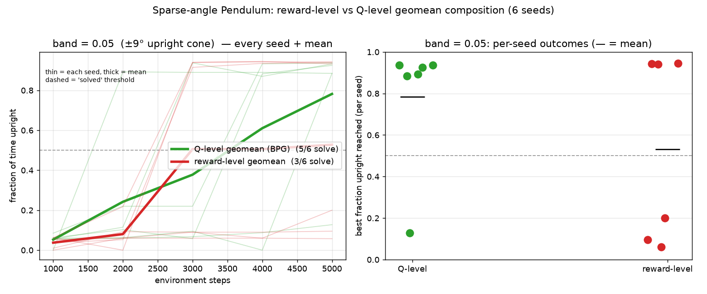
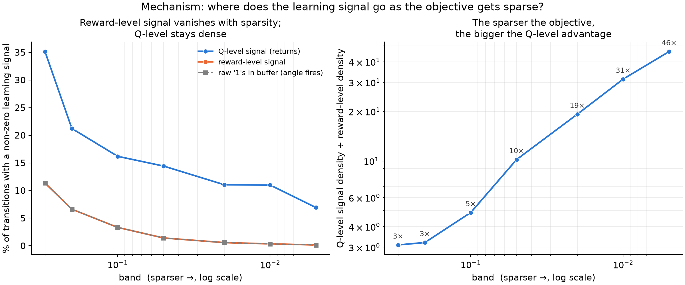
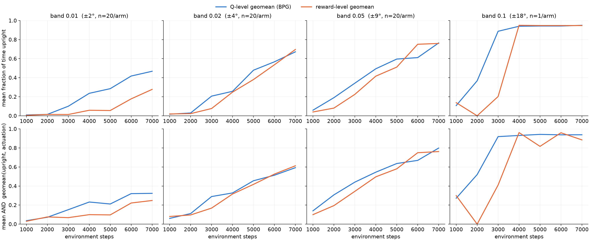
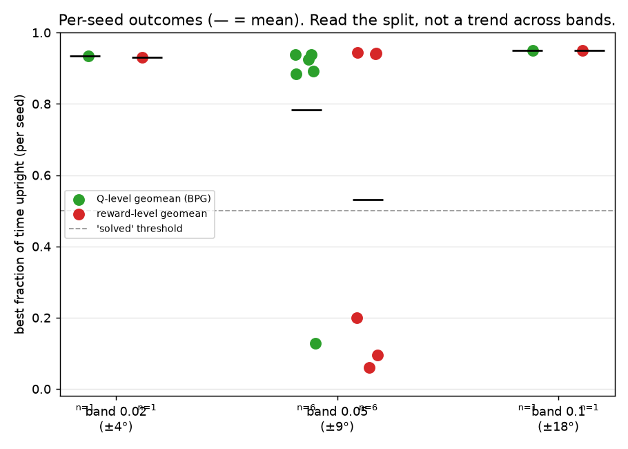

# Sparse-objective Pendulum: reward-level vs Q-level composition

Does composing objectives at the **Q-value level** (as Fulfillment Priority
Logic / BPG do) help when one objective is **sparse**? This experiment tests that
in the regime where it can actually matter — a gradient-based actor optimizing
two **simultaneous, competing** objectives, one of them **binary/sparse** — and
measures *why*.

**Bottom line:** yes, but it's a **sample-efficiency / reliability** effect, not a
"reward-level is impossible" one. As the sparse objective gets harder, the
reward-level learning signal collapses while the Q-level signal stays dense; in
the regime where they diverge, the Q-level agent reliably solves the task while
the reward-level agent often fails outright.

---

## TL;DR — the result

At a ±9° "upright" cone (`band=0.05`), 6 seeds, same training budget:



- **Q-level (BPG) solves 5/6 seeds; reward-level solves 3/6.** It's a **bimodal
  solve/fail split**, not a small average gap — on the failing seeds the
  reward-level agent never learns at all (stuck at ~6% time-upright, i.e. random).

And the reason, measured without training any agent:



- The **reward-level** signal is non-zero only when the binary objective fires
  *this step*, so it collapses toward 0 as the objective sparsifies. The
  **Q-level** signal stays dense because each objective's *value* (discounted
  return) spreads the rare events backward. The density advantage grows from
  **~3× at ±54° to ~46× at ±1°**.

---

## Why Pendulum and not a gridworld

A companion study (branch `claude/gallant-sagan-5yfwqm`, `TwoBeaconGridworld`)
found a *tabular* gridworld is the **wrong** testbed: it learns by `argmax` (no
gradient to smooth), and the only place reward-level composition is truly
degenerate is a task whose optimum is a non-stationary orbit a memoryless table
can't represent. The benefit of Q-level composition is about handing a
**gradient-based learner a smooth, dense signal** built from sparse per-objective
rewards — so the right testbed is continuous control with an actor network and
**ongoing competing** objectives. That is Pendulum.

## The environment and objectives

Two competing fulfillments in `[0, 1]` on the classic pendulum:

| objective | signal | type |
|---|---|---|
| `angle` | `1` iff the pole is within `band` of upright, else `0` | **binary / sparse** |
| `actuation` | `1 - (torque / max_torque)^2` | dense |

They compete: staying upright costs torque (lowering `actuation`), and the
upright signal is binary so most states give *no* angle gradient. `band` is the
**sparsity knob** — the half-width of the "counts as upright" cone, as a fraction
of π:

| band | upright cone | sparsity |
|---|---|---|
| 0.10 | ±18° | mild |
| 0.05 | ±9° | moderate |
| 0.02 | ±3.6° | extreme |

Both objectives are composed with the **geometric mean** (logical AND, `p=0`).
Everything else is held fixed; the experiment varies **only where the geomean is
applied**.

## The experiments

Files in this directory:

| file | what it does |
|---|---|
| `sparse_pendulum.py` | the fulfillments, the `RewardLevelWrapper`, the geomean, and the common evaluation. Building blocks; not run directly. |
| `run_sparsity_experiment.py` | trains the arms and sweeps `band`; writes `results/*.json`. |
| `mechanism.py` | **training-free** probe of *why* the Q level helps; writes `results/mechanism.png`. |
| `plot_results.py` | turns the JSONs into `learning_curves.png` + `per_seed_outcomes.png`. |

### 1. Sparsity sweep (`run_sparsity_experiment.py`)

Trains agents that are identical except for **where the geomean composes the two
objectives**:

| arm | composition | code path |
|---|---|---|
| `qlevel` | geomean of the two **Q-values** in the actor loss (BPG) | `CMORL(...)`, `p_objectives = 0` |
| `reward` | env returns `geomean(angle, actuation)` as a **scalar reward**, plain DDPG | `RewardLevelWrapper`, `cmorl = None` |
| `reward_slack` | same, geomean with `slack = 0.1` ("never output exactly 0") | `RewardLevelWrapper(slack=0.1)` |
| `qlevel_linear` | **ablation**: compose the Q-values *linearly* (`p=1`), not geomean | `CMORL(...)`, `p_objectives = 1` |

The `reward` vs `qlevel` pair isolates the one variable (composition location);
`reward_slack` tests Bassel's smoothing alternative; `qlevel_linear` separates
"compose at the Q level" from "the non-linear AND." Every arm is scored by the
**same** evaluation — fraction of time upright, mean actuation, and their geomean
— so the comparison is on the true objectives regardless of how each arm trained.

### 2. Mechanism probe (`mechanism.py`)

Rolls out a uniform-random policy (an early replay buffer) and measures the
*learning signal each composition would hand the learner*, with no training:

- reward-level signal `s_r = geomean(angle(t), actuation(t))`
- Q-level proxy `s_q = geomean(FV_angle(t), FV_actuation(t))`, where
  `FV_k(t) = (1-γ)·Σ_{k≥t} γ^{k-t} r_k` is the normalized discounted return-to-go
  of objective `k` — a Monte-Carlo stand-in for the fulfillment-Q a per-objective
  critic would learn.

It reports, vs `band`, the fraction of transitions carrying a non-zero signal and
the Q/reward density ratio.

### 3. Plots (`plot_results.py`)

`learning_curves.png` (mean upright + AND vs steps, per band) and
`per_seed_outcomes.png` (every seed's best result, with `n=` so single-seed bands
aren't misread as a trend).

## Results

### Headline — `band=0.05` (±9°), 6 seeds, 6-epoch budget

| | per-seed best fraction upright | solved (>0.5) |
|---|---|---|
| **Q-level (BPG)** | 0.93, 0.88, 0.94, 0.94, 0.13, 0.89 | **5 / 6** |
| **reward-level** | 0.06, 0.20, 0.94, 0.94, 0.09, 0.94 | **3 / 6** |

The Q-level mean curve sits clearly above reward-level, and the per-seed strip
(top figure) shows the bimodal split: reward-level either solves it (~0.94) or
completely fails (~0.06–0.20).

### Across bands (single-seed probes for 0.1 and 0.02)




- `band=0.1` (±18°): **both** arms learn — the top is hit often enough that even
  the reward-level geomean gets signal.
- `band=0.02` (±3.6°): single seed, both learn late and noisily — inconclusive at
  one seed.
- Only `band=0.05` has enough seeds to compare; treat 0.1/0.02 as context, not a
  trend (they're `n=1`).

### Why — the mechanism (`mechanism.png`, training-free)

| band | cone | reward-level signal ≠0 | Q-level signal ≠0 | Q ÷ reward |
|---|---|---|---|---|
| 0.30 | ±54° | 11.3% | 35.1% | ~3× |
| 0.10 | ±18° | 3.3%  | 16.2% | ~5× |
| 0.05 | ±9°  | 1.4%  | 14.4% | ~10× |
| 0.02 | ±4°  | 0.6%  | 11.1% | ~19× |
| 0.005| ±1°  | 0.1%  | 6.9%  | ~46× |

The reward-level signal exactly tracks the raw fire-rate (geomean is 0 unless the
binary part fires *now*); the Q-level signal stays dense because returns
propagate rare events. This is the quantity that explains the success-rate gap.

## Setup

Use the repo's standard environment (the BPG core needs TensorFlow; it also
imports `wandb` — auto-disabled here — and `tensorboard` for `tf.summary`; plots
need `matplotlib`):

```bash
conda env create --file environment.yml && conda activate cmorl_env   # or: nix develop --impure
pip install wandb tensorboard           # if not already present in the env
```

Everything runs on CPU. `WANDB_MODE=disabled` is set automatically by the runner.

## Reproduce the committed results exactly

Training is seeded with `TF_DETERMINISTIC_OPS` + op determinism enabled, so on the
same setup these commands regenerate the committed `results/*.json` **bit-for-bit**
(verified). The committed set was built from two configs during exploration:

```bash
# (1) single-seed probes at mild & extreme sparsity  (8-epoch budget -> 7 eval points)
python sparse_pendulum/run_sparsity_experiment.py \
    --bands 0.1 0.02 --arms qlevel reward --seeds 1 --epochs 8 \
    --steps-per-epoch 1000 --start-steps 500

# (2) the headline comparison at band=0.05, 6 seeds  (6-epoch budget -> 5 eval points)
python sparse_pendulum/run_sparsity_experiment.py \
    --bands 0.05 --arms qlevel reward --seeds 6 --epochs 6 \
    --steps-per-epoch 1000 --start-steps 500

# (3) figures from the JSONs
python sparse_pendulum/plot_results.py

# (4) the deterministic, training-free mechanism figure
python sparse_pendulum/mechanism.py
```

(`band0.05_seeds.png` is a per-seed composite figure; the reproducible figures are
`learning_curves.png`, `per_seed_outcomes.png` and `mechanism.png`.)

## Run the fuller study

The committed numbers are a short, CPU-budget **smoke check**, not
publication-grade. For a defensible result, run one consistent sweep with many
seeds, a fine band ladder, the smoothing baseline, the linear-composition
ablation, and a real training budget (ideally on GPU):

```bash
python sparse_pendulum/run_sparsity_experiment.py \
    --bands 0.15 0.1 0.07 0.05 0.03 0.02 0.01 \
    --arms qlevel qlevel_linear reward reward_slack --seeds 15 --epochs 150
python sparse_pendulum/plot_results.py
```

## Honest caveats

- The effect is a **reliability/sample-efficiency** edge, not "reward-level is
  impossible" — pendulum's top is visited often enough that reward-level usually
  recovers given enough exploration. This matches the paper's framing (a
  sample-efficiency improvement; up to 500% vs SAC on the full benchmarks), not
  the degenerate "0 everywhere" extreme.
- **5/6 vs 3/6 on 6 seeds is suggestive, not significant.** The fuller study is
  what turns this into a curve with error bars.
- Background training was signal-killed in the sandbox used to verify this, so the
  committed numbers came from short **foreground** runs — an environment quirk,
  not a code issue.
